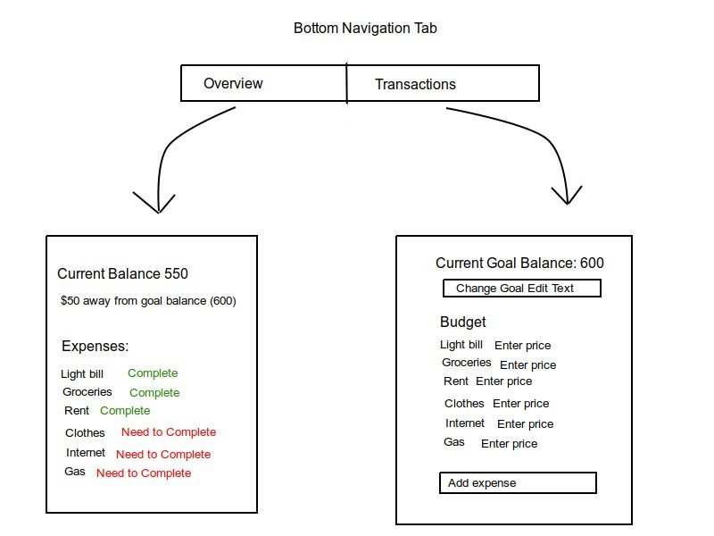
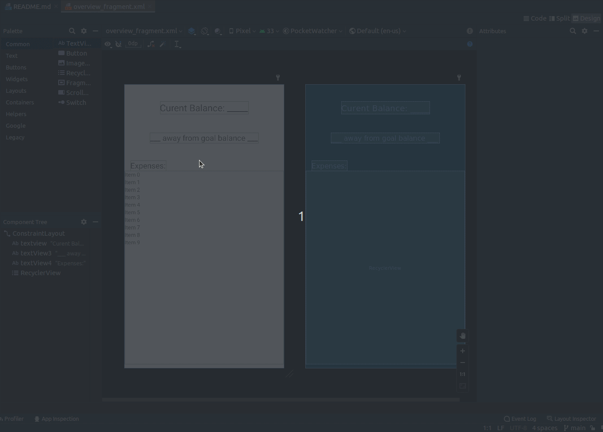

# PocketWatcher
Financial savings app that tracks your spending
# Milestone 1 - Pocket Watcher

## Table of Contents

1. [Overview](#Overview)
1. [Product Spec](#Product-Spec)
1. [Wireframes](#Wireframes)

## Overview
Financial savings app that tracks your spending

### Description

The app will allow the user to input a weekly and monthly balance that they would like to stick to and their spending habits. The app will advise the user what is more important to spend their money on based on their spending habits.

### App Evaluation

[Evaluation of your app across the following attributes]
- **Category: Financial**
- **Mobile: This app has good mobility because you spend the most money when you leave the house so it's good to keep track of your spending on the go.**
- **Story: It has a good story because personally, amongnst college students it can be difficult to save money.**
- **Market: It has a wide market because in order to stay afloat in today's world you have to correctly manage your money, and that applies to everyone.**
- **Habit: It would be used pretty frequently because you have to consider it every time you make a purchase.**
- **Scope: The scope is reasonable because it would be mostly based on user input of their balance and what they would like to purchase.**

## Product Spec

### 1. User Features (Required and Optional)

**Required Features**

* User should be able to enter a weekly and monthly goal balance
* Should be able to enter the cost of what they would like to buy
* Should advise users during questionable purchases

**Stretch Features**

* If there is money left over, it could be rolled over to the next week or month
* Left over money could be added to an investment account if selected
* Bank account could be connected to the users Pocket Watcher profile

### 2. Screen Archetypes

- Overview
  - Shows a summary of what has been purchased and what still needs to be purchased based on their needs
  - Show current balance
  - Show how close to goal balance you are
- Transactions
  - Shows everything that you want/plan to buy within that week or month
  - Has edit text box for you to add new transactions
  - Edit text box to enter their desired balance

### 3. Navigation

**Tab Navigation**

* Overview
* Transactions

## Wireframes

### [BONUS] Digital Wireframes & Mockups

### [BONUS] Interactive Prototype

# Gif Recordings
## Unit 8 Recording

